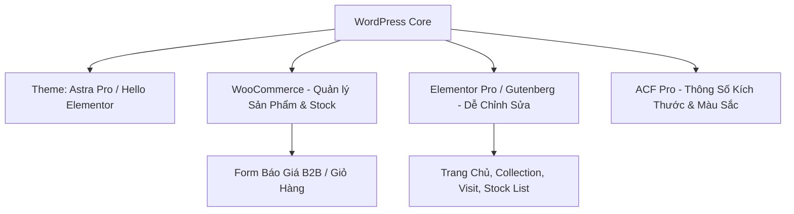

# Implementation Plan: Website Tham Khảo & Bán Chậu Cây / Vật Dụng Sân Vườn cho CTN NEXUS

Website được xây dựng trên nền tảng **WordPress** dành cho **CTN NEXUS COMPANY LIMITED**, lấy cảm hứng thiết kế & cấu trúc từ website tham khảo [potsandpithoi.com/pages/the-pots](https://potsandpithoi.com/pages/the-pots) và dựa trên toàn bộ dữ liệu nội dung, hình ảnh trong thư mục [NHA](file:///home/atat/Desktop/DOCS/app/docs).

---

## 1. Tổng Quan Yêu Cầu & Dữ Liệu Đầu Vào

### 1.1 Mục tiêu Dự án
- **Sản phẩm kinh doanh**: Chậu cây cảnh cao cấp (Gốm tráng men, Chậu khổng lồ, Chậu Atlantic, Đất nung, Đất sét tối màu, Xi măng & Fiberstone) và các vật dụng trang trí sân vườn liên quan.
- **Đối tượng khách hàng**: Đối tác B2B (xuất khẩu/bán buôn) & Khách hàng B2C.
- **Yêu cầu kỹ thuật**: Xây dựng trên WordPress để người dùng không chuyên có thể dễ dàng **Thêm / Xóa / Sửa** nội dung, sản phẩm, hình ảnh và banner mà không cần can thiệp vào code.

### 1.2 Phân Tích Dữ Liệu Trong Thư Mục `DOCS/NHA`
Sau khi kiểm tra chi tiết cấu trúc thư mục [DOCS/NHA](file:///home/atat/Desktop/DOCS/NHA):
1. **[Website.xlsx](file:///home/atat/Desktop/DOCS/app/docs/images/Website.xlsx)**: Chứa cấu trúc chi tiết 6 trang chính:
   - **`home`**: Banner slider, bài viết thương hiệu, 6 danh mục chính, header & footer.
   - **`collection`**: Trang tổng quan 6 danh mục chậu (tương tự trang `the-pots` / `for-the-garden` của Pots & Pithoi).
   - **`chi tiết mỗi mục cua collection`**: Danh sách sản phẩm của từng mục (ít nhất 10+ mẫu chậu/mục).
   - **`trang chi tiet cua 6 muc`**: Layout chi tiết cho từng loại sản phẩm (Hình ảnh, kích thước, màu sắc, mã chậu).
   - **`stock list`**: Danh mục các chậu có sẵn trong kho (10-12 ô hình ảnh phục vụ giao nhanh).
   - **`visit`**: Trang giới thiệu showroom/xưởng, thông tin liên hệ B2B, bản đồ.
2. **Thư mục [home page](file:///home/atat/Desktop/DOCS/app/docs/images/home%20page)**: Chứa 5 hình ảnh banner slider chuẩn cho trang chủ (`home page (1).jpg` đến `home page (5).jpg`).
3. **6 Thư mục danh mục sản phẩm**:
   - `1. GLALZED CERAMIC PLANTER` (Chậu gốm tráng men)
   - `2. GIANT PLANTER` (Chậu kích thước lớn/khổng lồ)
   - `3.ATLANTICS PLANTER` (Chậu phong cách Atlantic/giả cổ)
   - `4.TERRACOTTA PLANTER` (Chậu đất nung truyền thống)
   - `5.DARK CLAY PLANTER` (Chậu đất sét màu tối)
   - `6.FIBERSTONE & CEMENT PLANTER` (Chậu xi măng & đá sợi)

---

## 2. Điểm Cần Khách Hàng Xách Nhận (User Review Required)

> [!IMPORTANT]
> **Hình Thức Bán Hàng (B2B Quote vs B2C E-Commerce)**:
> File yêu cầu nhấn mạnh CTN NEXUS là đối tác B2B (Trusted B2B Partner). Quý khách muốn website hoạt động theo hướng:
> 1. **B2B Inquiry / Request a Quote (Khuyên dùng)**: Khách chọn chậu, chọn kích thước/màu sắc và gửi yêu cầu báo giá/đơn hàng trực tiếp qua Form/Email/WhatsApp.
> 2. **B2C Full E-Commerce**: Tích hợp thanh toán online trực tiếp qua cổng thanh toán (VNPay, PayPal, Stripe, v.v.).

> [!NOTE]
> **Ngôn Ngữ Website**:
> Nội dung giới thiệu trong Excel hiện tại bằng **Tiếng Anh** (phục vụ đối tác B2B quốc tế). Quý khách muốn làm website **100% Tiếng Anh** hay **Song ngữ Anh - Việt** (sử dụng plugin WPML/Polylang)?

---

## 3. Giải Pháp Công Nghệ & Kiến Trúc WordPress

### 3.1 Stack Công Nghệ
- **CMS Base**: WordPress 6.x (Phiên bản mới nhất).
- **Theme**: Astra Pro / Cadence / Hello Elementor – Nhẹ, chuẩn SEO, tối ưu tốc độ mobile 100%.
- **Page Builder**: Elementor Pro hoặc Gutenberg Block Editor (Spectra) – Cho phép quản trị viên kéo thả chỉnh sửa văn bản, thay ảnh slider, thêm khối nội dung dễ dàng.
- **Sản phẩm & Danh mục**: WooCommerce (Catalog Mode hoặc E-Commerce) giúp quản lý danh mục chậu, thuộc tính sản phẩm chuyên nghiệp.
- **Trường dữ liệu tùy biến**: Advanced Custom Fields (ACF) để tạo các ô nhập liệu cố định cho Admin (Chiều cao, Đường kính, Trọng lượng, Màu sắc, Nhiệt độ nung 1100°C).
- **Form Liên Hệ**: WPForms / Contact Form 7 tích hợp báo giá B2B.

---

## 4. Thiết Kế & Cấu Trúc Các Trang (Sitemap Detail)

### 4.1 Header & Custom Footer
- **Top Header**:
  - Hotline: `+84(0)976856365` | Email: `Anny.ctnnexus@gmail.com`
  - Địa chỉ: No. 17, 192 Phạm Đức Sơn, Phường Phú Định, Q.8, TP. Hồ Chí Minh.
- **Main Header**: Logo CTN NEXUS + Navigation Menu:
  - `HOME`
  - `COLLECTION` (Dropdown 6 danh mục)
  - `STOCK LIST`
  - `VISIT`
  - Biểu tượng Tìm kiếm & Giỏ hàng / Giỏ báo giá.
- **Custom Footer (Thiết kế sang trọng theo tông màu gốm mộc)**:
  - Cột 1: Giới thiệu ngắn CTN NEXUS COMPANY LIMITED & Logo.
  - Cột 2: Danh mục sản phẩm (6 dòng chậu chính).
  - Cột 3: Thông tin liên hệ (Địa chỉ xưởng/văn phòng, SĐT, Email).
  - Cột 4: Đăng ký nhận tin / Yêu cầu catalog B2B (Newsletter).

---

### 4.2 Trang Chủ (`HOME`)
1. **Hero Slider Section**:
   - Slider tự động chuyển 4-5 hình ảnh chất lượng từ thư mục `app/docs/images/home page`.
   - Nội dung đè (Overlay): Tiêu đề thương hiệu + Nút kêu gọi hành động "Explore Collection".
2. **Craftsmanship Story (Giới thiệu thủ công)**:
   - Đoạn văn mẫu từ Excel:
     > *"Our pots are meticulously handcrafted by skilled artisans in Vietnam, employing traditional techniques passed down through generations. Fired at high temperatures exceeding 1100°C, subtle variations in colour, texture, and detail naturally emerge, ensuring that no two pieces are exactly alike..."*
3. **Featured Collections Grid (6 Danh mục chính)**:
   - Grid 6 ô hình ảnh đại diện cho 6 loại chậu:
     1. Glazed Ceramic Planters
     2. Giant Planters
     3. Atlantic Planters
     4. Terracotta Planters
     5. Dark Clay Planters
     6. Fiberstone & Cement Pots
   - Hiệu ứng hover mượt mà (Zoom nhẹ + Tiêu đề nổi bật).
4. **Why Choose CTN Nexus (B2B Value Proposition)**:
   - Nung nhiệt độ cao 1100°C+, độ bền thời tiết, xuất khẩu toàn cầu, quy trình kiểm soát chất lượng nghiêm ngặt.

---

### 4.3 Trang Collection (`COLLECTION` - Phong cách Pots & Pithoi)
- Lấy cảm hứng trực tiếp từ [potsandpithoi.com/pages/the-pots](https://potsandpithoi.com/pages/the-pots).
- Hiển thị danh mục tổng thể với hình ảnh banner chuẩn nét cho từng dòng chậu.
- Khi người dùng click vào 1 trong 6 danh mục -> Chuyển đến trang danh sách chậu của danh mục đó (Chứa 10-15 mẫu chậu thực tế như `NGC0005-Tall Tapered Planter`, `NGC0006-Conical Planter`, v.v.).

---

### 4.4 Trang Chi Tiết Sản Phẩm (`Product Detail Page`)
- **Bộ sưu tập ảnh (Gallery)**: Ảnh chậu góc rộng, ảnh chi tiết bề mặt men/đất nung.
- **Bảng Thông Số Kỹ Thuật (Product Specifications Table)**:
  - Mã sản phẩm (SKU/Code): e.g. `NGC5008`
  - Loại chậu (Category): Glazed Ceramic / Terracotta...
  - Kích thước (Dimensions): Top Dia x Height (cm/inches)
  - Màu sắc (Available Colors): Trắng men, xanh ngọc, đất nung tự nhiên, xám xi măng...
  - Quy cách đóng gói (Packaging): Pallet xuất khẩu.
- **Nút Yêu Cầu Báo Giá (Request B2B Quote)**: Mở Modal Pop-up Form điền số lượng cần mua & thông tin doanh nghiệp.

---

### 4.5 Trang Stock List (`STOCK LIST`)
- Thiết kế dạng lưới (Grid 10-12 ô) trưng bày các mẫu chậu **đang có sẵn hàng tại kho** giao ngay.
- Giúp khách hàng đối tác nhanh chóng chọn mã chậu cần gấp mà không phải chờ sản xuất.

---

### 4.6 Trang Tham Quan & Liên Hệ (`VISIT`)
- Dựa trên nội dung từ Excel & mẫu [potsandpithoi.com/pages/visit](https://potsandpithoi.com/pages/visit):
  - Lời mời tham quan xưởng sản xuất / showroom CTN NEXUS tại TP.HCM.
  - Thông tin doanh nghiệp đầy đủ:
    - **Tên công ty**: CTN NEXUS COMPANY LIMITED
    - **Địa chỉ**: NO. 17, 192 PHAM DUC SON, PHU DINH WARD, HOCHIMINH CITY, VIETNAM
    - **Điện thoại**: +84(0)976856365
    - **Email**: Anny.ctnnexus@gmail.com
  - Bản đồ Google Maps nhúng trực tiếp.
  - Form đăng ký lịch hẹn làm việc đối tác B2B.

---

## 5. Hướng Dẫn Quản Trị Cho Người Dùng (User-Friendly Admin)

Dự án được cấu hình sẵn hệ thống quản trị trực quan:
1. **Thay đổi Banner/Trang chủ**: Dùng công cụ kéo thả Elementor/Gutenberg -> Click vào ảnh để chọn ảnh mới từ Media Library.
2. **Thêm/Sửa/Xóa Sản Phẩm**: Vào mục **Products -> Add New** trong WordPress:
   - Nhập tên chậu & mã SKU.
   - Chọn Danh mục (1 trong 6 loại chậu).
   - Nhập kích thước & màu sắc vào các ô ACF chuẩn bị sẵn.
   - Upload bộ ảnh chậu.
3. **Quản lý Đơn hàng/Yêu cầu báo giá**: Tất cả yêu cầu báo giá sẽ gửi tự động về Email `Anny.ctnnexus@gmail.com` và lưu trong trang quản trị WordPress.

---

## 6. Kế Hoạch Triển Khai & Kiểm Thử (Verification Plan)

### 6.1 Các Bước Thực Hiện
1. **Khởi tạo môi trường WordPress**: Cài đặt WordPress, thiết lập HTTPS, Theme & Plugins cốt lõi.
2. **Xây dựng Design System**: Cấu hình bảng màu (Terracotta brown, Warm clay, Charcoal, Emerald green) & Font chữ sang trọng (Playfair Display / Serif + Inter / Sans-serif).
3. **Dựng khung giao diện (Layout)**: Tạo 6 trang chính theo chuẩn `Website.xlsx`.
4. **Import Dữ liệu & Media**: Upload toàn bộ hình ảnh chậu từ 6 thư mục sản phẩm và 5 ảnh trang chủ trong thư mục [NHA](file:///home/atat/Desktop/app/docs).
5. **Cấu hình Form & Chức năng B2B Quote**: Kiểm tra gửi mail & lưu thông tin báo giá.

### 6.2 Kiểm Thử (Verification)
- **Kiểm thử Responsive**: Kiểm tra giao diện hiển thị hoàn hảo trên Mobile, Tablet, Laptop, Screen 4K.
- **Kiểm thử Quản trị**: Đảm bảo tài khoản người dùng có thể dễ dàng thêm chậu mới và sửa bài viết mà không gặp lỗi.
- **Tốc độ tải trang**: Tối ưu dung lượng hình ảnh (WebP format), kích hoạt cache để trang nạp dưới 2 giây.

---

> [!TIP]
> Kế hoạch này đã sẵn sàng. Sau khi Quý khách xác nhận các yêu cầu trong **Mục 2 (User Review Required)**, chúng ta có thể tiến hành dựng demo giao diện WordPress lập tức!
